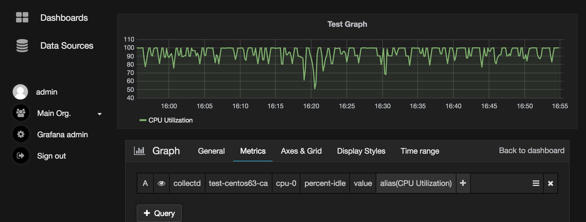
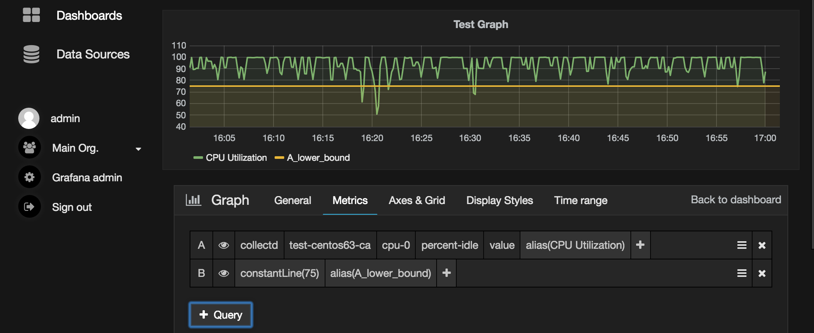
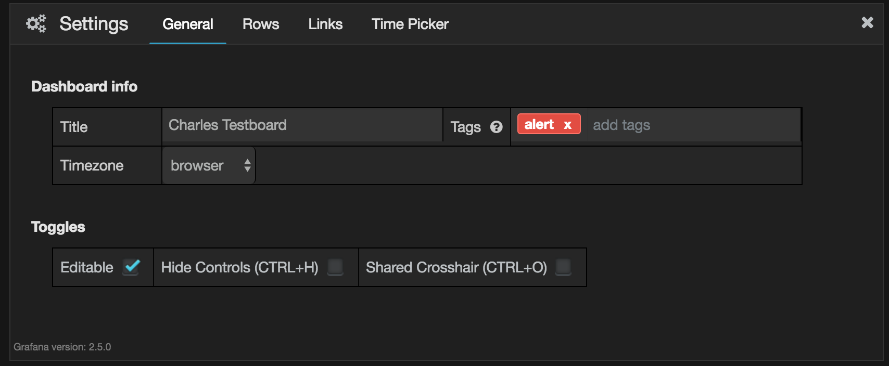

Flapjack Grafana Receiver
=========================

Flapjack-grafana-receiver is a tool to generate monitoring events based on Grafana board definitions
and feed the events to flapjack for alerting. It is lightweight, easy to setup and customizable.

Flapjack is a monitoring notification and event processing system. 

This is project is currently in MVP stage. Depending on the adoption, new features might be added in the future. 
Scroll to the bottom to see the limitations. Pull requests are welcome.

TOC
---
1. [Prerequisites](#prerequisites)
2. [Installation](#installation)
3. [Configuration](#configuation)
4. [Usage](#usage)
5. [Adding alert](#addingalert)
6. [Limitations](#limitations)

## Prerequisites

+ Grafana endpoint and access token
+ Flapjack redis server information
+ Node js >= 0.10

## Installation

```bash
$ git clone <this repo>
$ cd flapjack-grafana-receiver
$ npm install
```

## Configuration

Put your configuration in a local-config.js in the flapjack-grafana-receiver folder. See example below.

```javascript 
module.exports = {
  grafana_endpoint : 'http://grafana.mycompany.com/',
  grafana_access_token : 'adksj89PNHJHH78924jehklfhkehua37auhwaehBULIughuhYGUyu239r8923ytweuh=',
 
  redis: {
    host: 'flapjack-sever.mycompany.com',
    port: 6380,
  },
};
```

Check the config.js to understand more available options.

## Usage

```bash
$ node . -h
Scan the grafana dashboards and generate alerts based on
target definitions and send to flapjack redis server. See
wiki for detail.

Usage: node flapjack-grafana-receiver.js [ -h|--help ] [ -d|--daemon ] [ -v|--verbose]

Optional:
 -h | --help:    print this message
 -d | --daemon:  run in daemon mode
 -v | --verbose: provide more verbose output to console

Required configurations for redis connection, grafana endpoint
should be provided in config.js
```

## Adding alert

Adding alert to a metric is basically adding another metirc in the same panel with alias '<refid>_lower|upper_bound'. 

Taking below board as an example. 


To add a alerting for the "CPU Utilization" metric when it is below 75%, just add a new metric and use alias "A_lower_bound".
Letter "A" is the "refId" of the "CPU utilization". You can hide the new metric if you want. Below is the udpated board.



Finally, you need to add a tag "alert" to the dashboard like below.


## Limitations

+ Supports only Graphite backend as of now
+ Graphite authentication has not been implemented
+ Single threaded

Pull requests are welcome!

